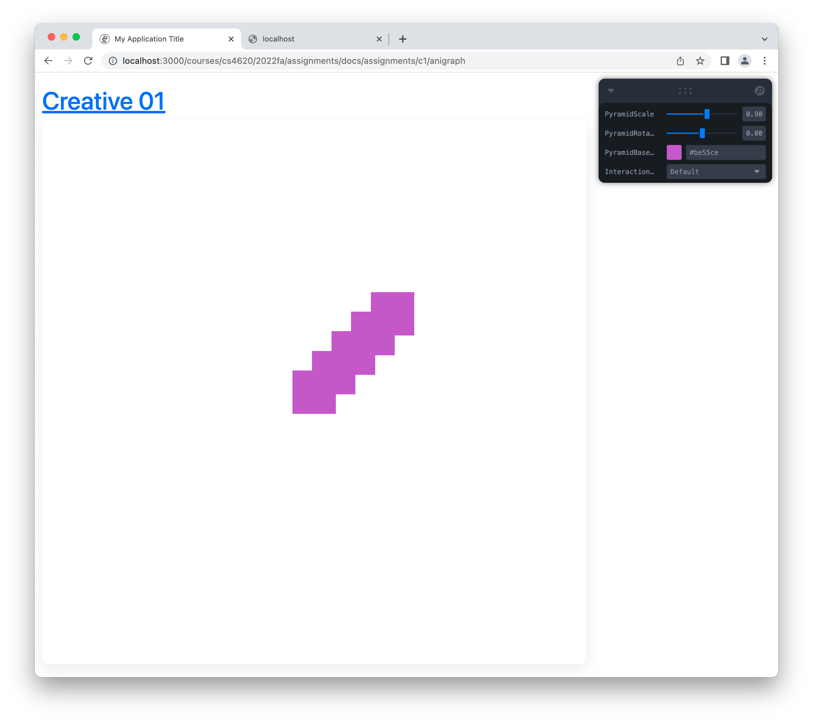

# Pyramid Starter / Polygon Instancing Scene

This starter code shows you how to create multiple instances of geometry, transform each one independently, and connect parameters of the scene to control panel controls.

This is a good starting point for those of you interested in creating procedural art or animation for C1. 

The image below shows what things look like when you run the starter code. You can change the color of the polygons and use the PyramidScale placeholder slider to change how much each copy is translated from the next.




In [CustomSceneModel.ts](./CustomSceneModel.ts) you will find the scene data model.
The `initScene()` function is a good place to initialize your scene. The starter code shows you how to add variables to the control panel and how to create and add a model to the scene. The model is called pyramid just because I based this starter code on the pyramid example; you are welcome to use this starter code to do something else though.
```typescript
    initScene() {
        appState.addSliderControl(CustomPolygonModel.AppStateKeys.PyramidScale, 0.9, 0.5, 1.2, 0.01);
        appState.addSliderControl(CustomPolygonModel.AppStateKeys.PyramidRotation, 0, -Math.PI, Math.PI, 0.01);
        appState.addColorControl(CustomPolygonModel.AppStateKeys.PyramidBaseColor, Color.RandomRGBA());
        const self = this;
        let pyramid = new CustomPolygonModel();
        pyramid.setMaterial(this.materials.createRGBAShaderMaterial());
        // pyramid.verts.addVertex(Vec2.Random([-0.5,0.5]).times(this.sceneScale), Color.Random());

        pyramid.setVerts(VertexArray2D.SquareXYUV(2))
        this.addChild(pyramid);
    }
```

In [CustomSceneController.ts](./CustomSceneController.ts) you will find functions that you can use to implement interactivity.

- The `onKeyDown` and `onKeyUp` callback gets called when keyboard keys are pressed and released.,
- The `onClick` callback gets called when the mouse is clicked.
- the `dragStartCallback`, `dragMoveCallback`, and `dragEndCallback` define a drag interaction. The `dragStartCallback` gets called when the mouse is pressed, then the `dragMoveCallback` gets called when the mouse moves while pressed, and the `dragEndCallback` gets called when the mouse is released.
